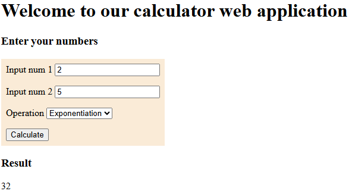

# SIT737 - 2025 - Prac 4c

This is a practical exercise of SIT737 (Week 4, credit task)




## Features included
### Base feature
- Logging with `Winston`
  - All logs are stored at **logs/combined.log**
  - Error logs are stored at **logs/error.log**
- Calculator services API:
  - Addition operation at `localhost:3040/add?n1={n1}&n2={n2}`
  - Subtraction operation at `localhost:3040/sub?n1={n1}&n2={n2}`
  - Multiplication operation at `localhost:3040/mul?n1={n1}&n2={n2}`
  - Division operation at `localhost:3040/div?n1={n1}&n2={n2}`
- Calculator web UI at `localhost:3040`

### Updated advanced feature <span style="color: red">(new)</span>
- New calculator services API:
  - Exponentiation operation at `localhost:3040/exp?n1={n1}&n2={n2}`
  - Square root operation at `localhost:3040/sqrt?n1={n1}`
  - Modulo operation at `localhost:3040/mod?n1={n1}&n2={n2}`
- New calculator options for web UI `localhost:3040`

## How to run
- Step 1: Clone this repository branch
  ```
  git clone -b prac4c https://github.com/TUT888/sit737-2025.git
  ```
- Step 2: Install dependencies (you must have Node.js installed in your device first)
  ```
  npm install
  ```
- Step 3: Run the server:
  ```
  npm start
  ```

## Step by step process
Step-by-step instructions that explain the process as below:
1. **Set up server**
  - Import the express
  - Create a new express server and serve all files in public folder
  - Define the port
2. **Set up winston logger**
  - Import winston
  - Create new winston logger, which will log all important level of info or less to `combined.log` and error in `error.log`
  - Set up the logger to print the log to the console in development only
3. **Define the services**
  - Prepare the calculation, input validation and error handling functions
  - Define the main entry of the web app, rendering `index.html` by default
  - Define the endpoint APIs with GET request (add, sub, mul, div)
4. **Start the app with the defined port**