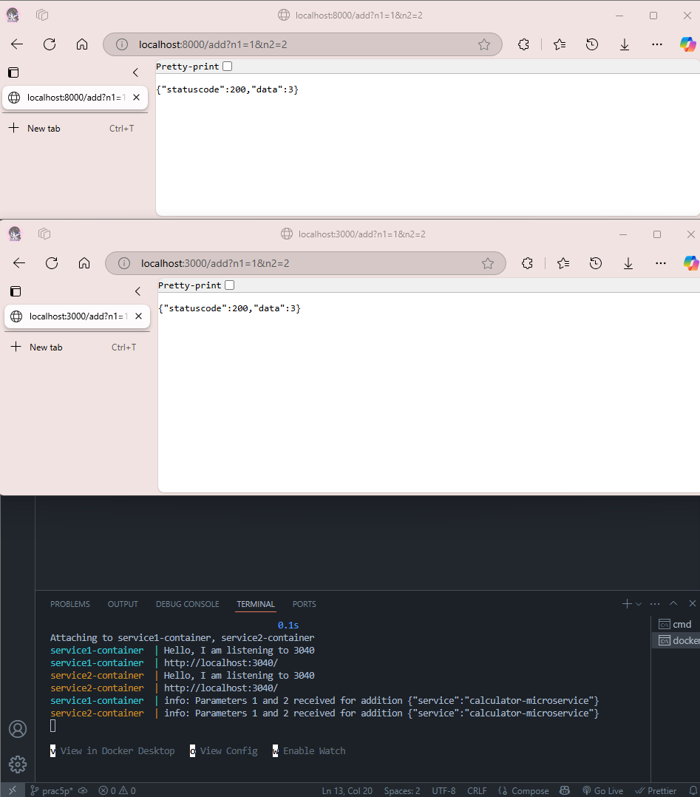

# SIT737 - 2025 - Prac 5p

This is a practical exercise of SIT737 (Week 5, pass task)



## Step by step process
Step-by-step instructions that explain the process as below:
### Development
1. **Set up server**
    - Import the express
    - Create a new express server and serve all files in public folder
    - Define the port
2. **Set up winston logger**
    - Import winston
    - Create new winston logger, which will log all important level of info or less to `combined.log` and error in `error.log`
    - Set up the logger to print the log to the console in development only
3. **Define the services**
    - Prepare the calculation, input validation and error handling functions
    - Define the main entry of the web app, rendering `index.html` by default
    - Define the endpoint APIs with GET request (add, sub, mul, div)
4. **Start the app with the defined port**

### Containerization <span style="color: red">(new)</span>
1. Create a Dockerfile: [Dockerfile](./Dockerfile)
    - Specify the node version
    - Define the path to the application
    - Copy all dependencies requirements from package*.json to current path
    - Use `RUN npm install` to install all requirements
    - Bundle the app source (`index.js`)
    - Expose the app to specified port, and add run command for the image
2. Build the Docker image named `app-service1-5p` and `app-service2-5p`
    ```
    docker build -t app-service1-5p .
    docker build -t app-service2-5p .
    ```
3. Create a Docker compose file [docker-compose.yml](./docker-compose.yml)
    - Specify the version
    - Define the services, each needs to include
        - The directory to build the application (must include Dockerfile)
        - Container name for the service
        - Mapping the ports (`host-machine-port`:`container-port`)
4. Start Docker Compose environment
    ```
    docker compose up
    ```
5. Test the application of each service using the mapped port. In this application, as defined in `docker-compose.yml`, we have 2 services:
    - Port 8000 for service 1 <br>
      => Access the calculation through `http://localhost:8000/add?n1=1&n2=2`
    - Port 3000 for service 2 <br>
      => Access the calculation through `http://localhost:3000/add?n1=1&n2=2`
6. Push the Docker image to a registry
    ```
    docker tag app-service1-5p <yourusername>/app-service1-5p:latest
    docker push <yourusername>/app-service1-5p:latest
    ```

## Features included
### Base feature
- Logging with `Winston`
    - All logs are stored at **logs/combined.log**
    - Error logs are stored at **logs/error.log**
- Calculator services API:
    - Addition operation at `localhost:3040/add?n1={n1}&n2={n2}`
    - Subtraction operation at `localhost:3040/sub?n1={n1}&n2={n2}`
    - Multiplication operation at `localhost:3040/mul?n1={n1}&n2={n2}`
    - Division operation at `localhost:3040/div?n1={n1}&n2={n2}`
- Calculator web UI at `localhost:3040`

### Updated advanced feature
- New calculator services API:
    - Exponentiation operation at `localhost:3040/exp?n1={n1}&n2={n2}`
    - Square root operation at `localhost:3040/sqrt?n1={n1}`
    - Modulo operation at `localhost:3040/mod?n1={n1}&n2={n2}`
- New calculator options for web UI `localhost:3040`

## How to run
### Node.js application
- Step 1: Clone this repository branch
    ```
    git clone -b prac5p https://github.com/TUT888/sit737-2025.git
    ```
- Step 2: Install dependencies (you must have Node.js installed in your device first)
    ```
    npm install
    ```
- Step 3: Run the server:
    ```
    npm start
    ```

### Docker container <span style="color: red">(new)</span>
- Step 1: Pull the docker image
    ```
    docker pull tut888/app-service1-5p:latest
    ```
- Step 2: Run the container
    ```
    docker run -p 8000:8000 app-service1-5p
    ```